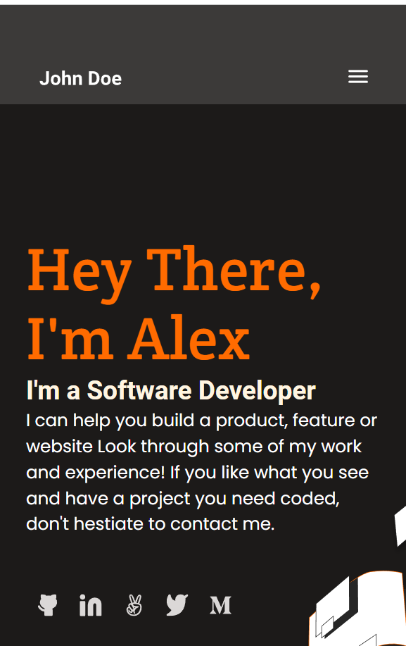
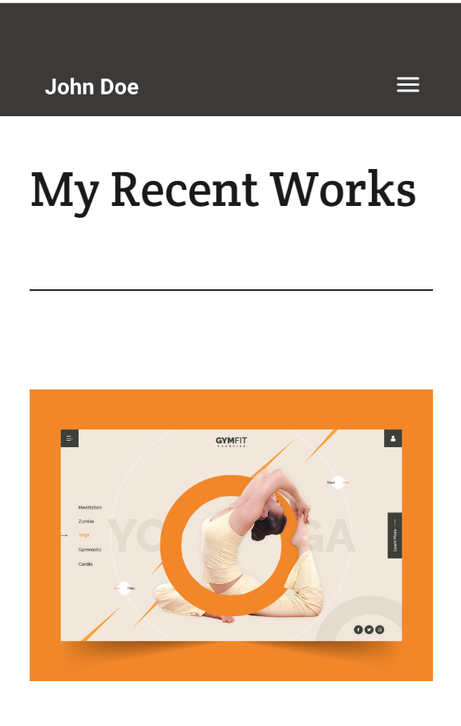
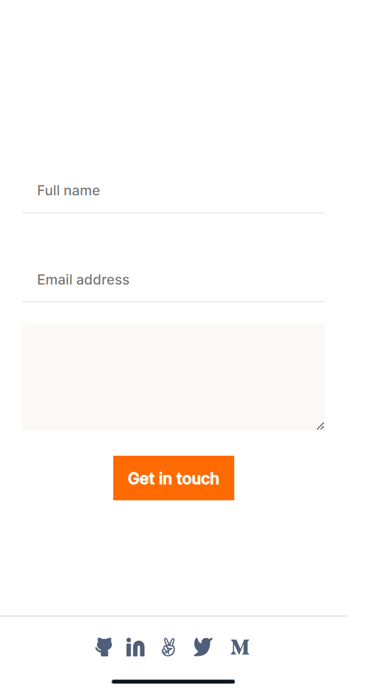

<a name="readme-top"></a>

<div align="center">
 <h3><b>Portfolio </b>.
 </h5>
</div>

<div align="center">
<h3><b>Mobible version screenshot</b></h3>



</div>

<!-- TABLE OF CONTENTS -->

# 📗 Table of Contents

- [📖 About the Project](#about-project)
  - [🛠 Built With](#built-with)
    - [Tech Stack](#tech-stack)
    - [Key Features](#key-features)
  - [🚀 Live Demo and presentation video](#live-demo)
- [💻 Getting Started](#getting-started)
  - [Setup](#setup)
  - [Prerequisites](#prerequisites)
  - [Install](#install)
  - [Usage](#usage)
  - [Run tests](#run-tests)
  - [Deployment](#triangular_flag_on_post-deployment)
- [👥 Authors](#authors)
- [🔭 Future Features](#future-features)
- [🤝 Contributing](#contributing)
- [⭐️ Show your support](#support)
- [🙏 Acknowledgements](#acknowledgements)
- [📝 License](#license)

<!-- PROJECT DESCRIPTION -->

# 📖 Portfolio <a name="about-project"></a>

**portfolio** is my first project for learning Git and GitHub workflows</b></h3>
<h5>This is my portfolio website that is made as a part of Microverse's task although I'll use it for my portfolio when will be completed.I create a complete mobile version and desktop version. It has four main sections headline, works, about me, and a contact form. Thanks ❤️ to my coding partner <b> MEHMET Selçuk Güler </b> for contributing to creating the mobile menu interactivity.<b> In this milestone, we have created mobile and desktop version popUp window using js 

## 🛠 Built With <a name="built-with"></a>

# Tech Stack <a name="tech-stack"></a>

<details>
  <summary>Client</summary>
  <b>This project only works client side right now.</b>
  <ul>
    <li>HTML</li>
    <li>CSS</li>
    <li>JS</li>
  </ul>
</details>

<!-- Features -->

# Key Features <a name="key-features"></a>

- **Showcase developer achievements**

<p align="right">(<a href="#readme-top">back to top</a>)</p>

<!-- LIVE DEMO -->

## 🚀 Live Demo<a name="live-demo"></a>

- [Live Demo Link](https://abdussattar-70.github.io/portfolio)

<p align="right">(<a href="#readme-top">back to top</a>)</p>

<!-- GETTING STARTED -->

## 💻 Getting Started <a name="getting-started"></a>

To get a local copy up and running, follow these steps.

# Prerequisites

In order to run this project you need:
### It would be best if you had some familiarity with `HTML`, `CSS`, and `JS`.

- A Computer (MAC or PC)
- code editor (VSCode,Atom etc...)
- A browser (Chrome,Mozilla,Safari etc...)
- Version Control System (Git and Github)

# Setup

Clone this repository to your desired folder:

 ``` bash
        git clone https://github.com/AbdusSattar-70/portfolio.git
        cd portfolio 
 ```

# Install

Install this project with:

``` bash 
     npm install
```

# Run tests

To run tests, run the following command:

- To check Styelint error:-

``` bash
   npx stylelint "\*_/_.{css,scss}"
```
- To check Eslint error:-
```bash
  npx exlint .
```
- To check webhint error:-
```bash
  npx hint .
```

# Deployment

You can deploy this project using:

```bash
   npm run build
```

<p align="right">(<a href="#readme-top">back to top</a>)</p>

<!-- AUTHORS -->

## 👥 Authors <a name="authors"></a>

## 👤 Abdus Sattar

- GitHub: [AbdusSattar-70](https://github.com/AbdusSattar-70)
- Twitter: [Abdus Sattar](https://twitter.com/Abdus_Sattar70)
- LinkedIn: [Abdus Sattar](https://www.linkedin.com/in/abdus-sattar-a41a26215/)

<p align="right">(<a href="#readme-top">back to top</a>)</p>

<!-- FUTURE FEATURES -->

## 🔭 Future Features <a name="future-features"></a>

- [ ] **Preserve data in the browser**
- [ ] **Display Data From API**
- [ ] **POST Data to API**

<p align="right">(<a href="#readme-top">back to top</a>)</p>

<!-- CONTRIBUTING -->

## 🤝 Contributing <a name="contributing"></a>

Everybody is welcome to suggest, changes,Contributions, issues, and feature request in portfolio html css file.

In order to do it, fork this repository, create a new branch and open a Pull Request from your branch.

Feel free to check the [issues page](../../issues/).

<p align="right">(<a href="#readme-top">back to top</a>)</p>

<!-- SUPPORT -->

## ⭐️ Show your support <a name="support"></a>

If you like this project, Please give me ⭐️ and you can use it following [MIT](./LICENSE) license.

<p align="right">(<a href="#readme-top">back to top</a>)</p>

<!-- ACKNOWLEDGEMENTS -->

## 🙏 Acknowledgments <a name="acknowledgements"></a>

Thanks ❤️ to my coding partner <b> @Santosh-Konappanavar </b> for contributing to creating the contact form section.Also Thanks ❤️ to my coding partner <b> @Baqar Abbas </b> and <b> @Shu Richmond </b> for contributing to checking web accessibility and implement.
Thanks ❤️ to my coding partner <b> MEHMET Selçuk Güler
</b> for contributing to creating the mobile menu interactivity.

I would like to thank and appreciate who contributes this project.

<p align="right">(<a href="#readme-top">back to top</a>)</p>

<!-- LICENSE -->

## 📝 License <a name="license"></a>

This project is under [MIT](./LICENSE) licensed.

<p align="right">(<a href="#readme-top">back to top</a>)</p>
